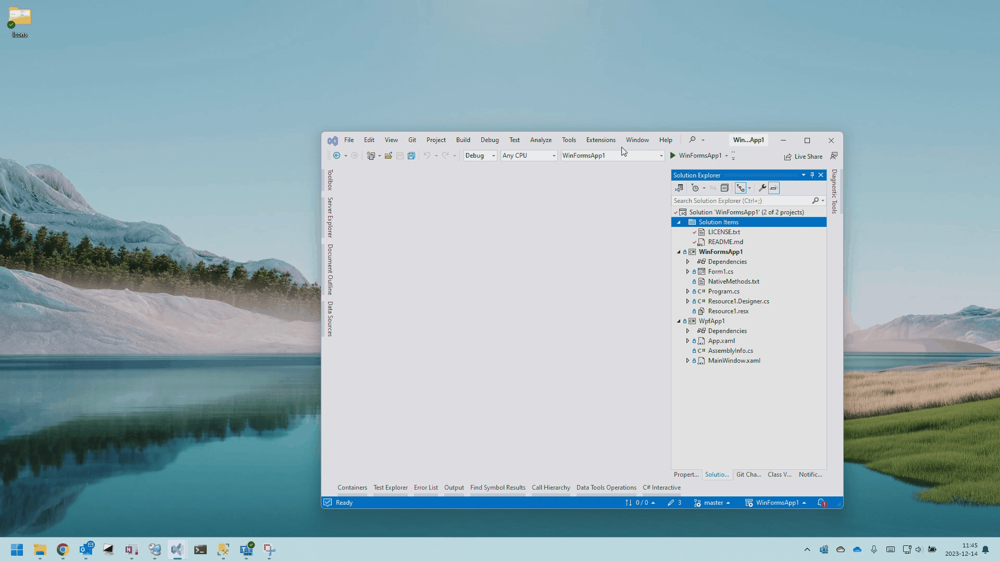

# Sample of WPF/WinForms app snap
Demo of using `SetWindowPos` to position apps in a manner similar to Aero Snap.
Uses [`Esatto.Win32.CustomControls`](https://www.nuget.org/packages/Esatto.Win32.CommonControls/#readme-body-tab) for P/Invoke.

## Key steps
1. Before you show your window, capture the previous window
1. Validate that the previous window is a window you want to resize (e.g.: not the taskbar)
1. If the previous window is maximized, restore it so that it can be resized
1. Pick a monitor upon which to show your window
1. Position your window
1. Use `SetWindowPos` to resize the previous window to fill the remaining space

## Notes
* This sample does not handle the case where the previous window is maximized on a 
  monitor that is not the monitor you want to use.  Such a case is challenging since
  the shadow frame added by DWM varies by monitor DPI.
* The sample uses a non-resizable borderless window for your window to avoid having
  to compensate for shadow border.